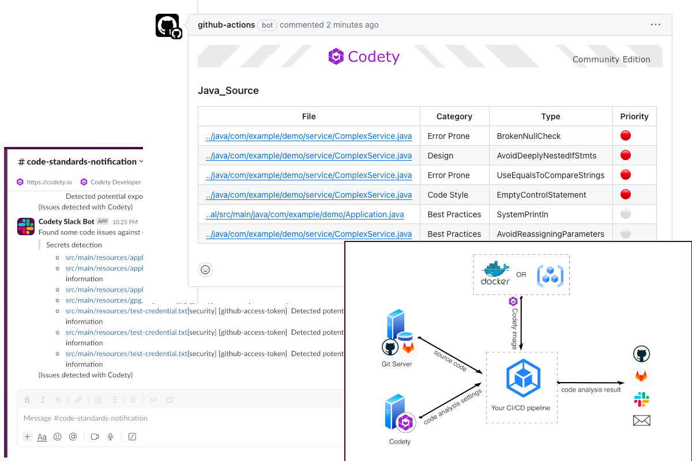

# Introduction

**Codety Scanner** is a comprehensive and versatile source code scanner that detects code issues for 20+ programming languages and IaC tools. Codety Scanner's source code is contributed and maintained by Codety Inc.([https://codety.io](https://codety.io/))

#### Codety Scanner can:
* Scan and detect code issues using 5000+ rules(both Codety built and community built rules), be able to detect issues like:
   * Insecure and vulnerable code
   * Unexpected secrets/tokens/API-Keys in the code
   * Code smells and technical debt accumulation
   * Code style violations
   * Some performance issues
   * And more...
* Support 30+ programming languages and IaC tools.
* Compile scanning result and send notifications via different channels like:
   * GitHub pull request review comments
   * Slack
   * GitLab merge request review comments(coming...)
   * Email (coming...)

#### You can run Codety Scanner from:
* Any operating system that installed Java Runtime.
* Any compute environment that can pull and run docker image.

#### You can use Codety Scanner for:
* Commercial and personal use

:::tip tips

* The Codety static code analysis will be running inside your CI/CD workflow, and your code will not leave your CI/CD compute environment.
* It is recommended to trigger Codety analysis pull/merge request events to receive prompt and relevant code analysis results, ensuring code quality is maintained.

:::

