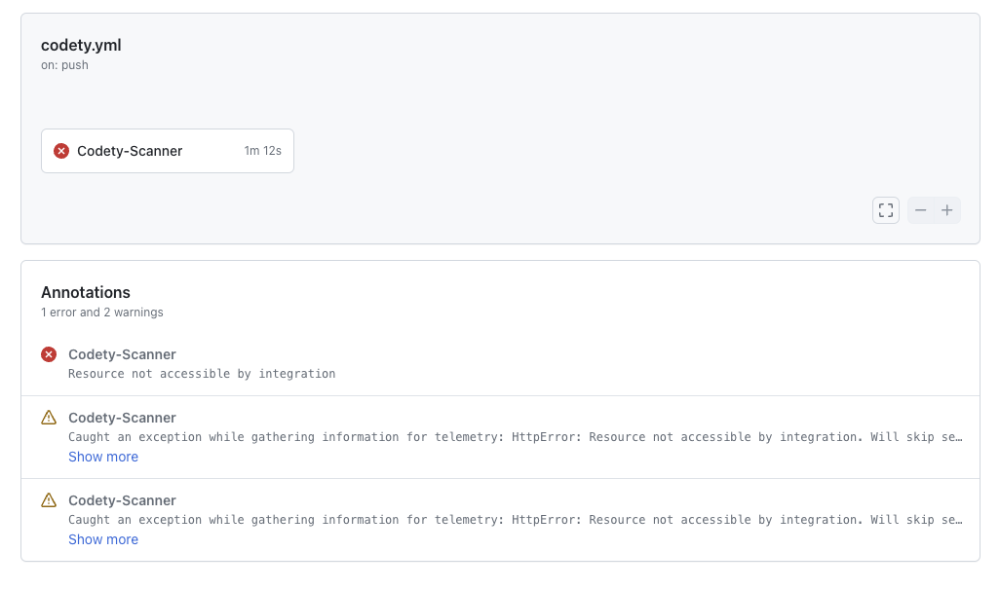
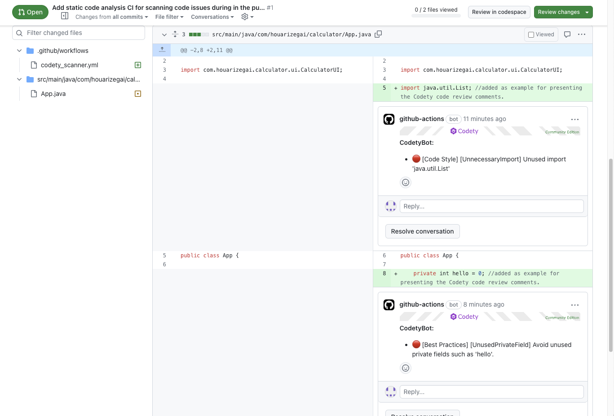

### What to do if you get issue uploading SARIF file into GitHub? 


#### Context:
GitHub's "GitHub Advanced Security code scanning" is available for all public repositories on GitHub.com. Code scanning is also available for private repositories owned by organizations that use GitHub Enterprise Cloud and have a license for GitHub Advanced Security. 

#### symptom:
If you got below issue during the Sarif file upload:
```bash

Run github/codeql-action/upload-sarif@v3
/usr/bin/docker exec  bc1b5c4d880f80a803c9d5563a5a7094ea7b36aac1cec0b4285db847c3957df3 sh -c "cat /etc/*release | grep ^ID"
Warning: Caught an exception while gathering information for telemetry: HttpError: Resource not accessible by integration. Will skip sending status report.
Uploading results
  Processing sarif files: ["codety-scanning-result.sarif"]
  Validating codety-scanning-result.sarif
  Combining SARIF files using the CodeQL CLI
  Adding fingerprints to SARIF file. See https://docs.github.com/en/enterprise-cloud@latest/code-security/code-scanning/integrating-with-code-scanning/sarif-support-for-code-scanning#providing-data-to-track-code-scanning-alerts-across-runs for more information.
  Error: Resource not accessible by integration
  Warning: Caught an exception while gathering information for telemetry: HttpError: Resource not accessible by integration. Will skip sending status report.
  
```



#### Solution:
You can use Codety's pull request review comment feature for free that has similar feature that can post annotations inline. 


