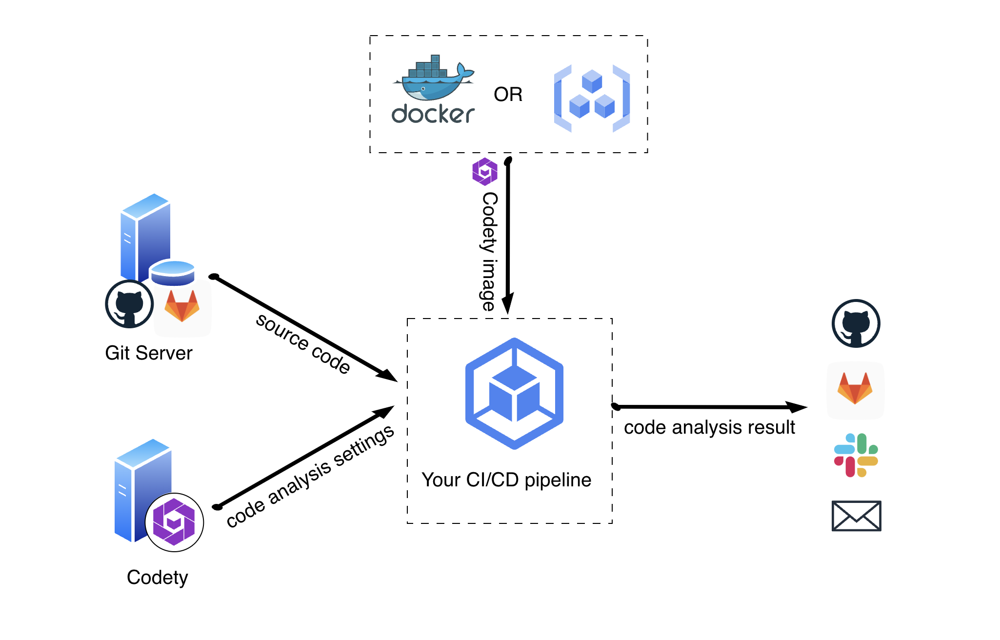
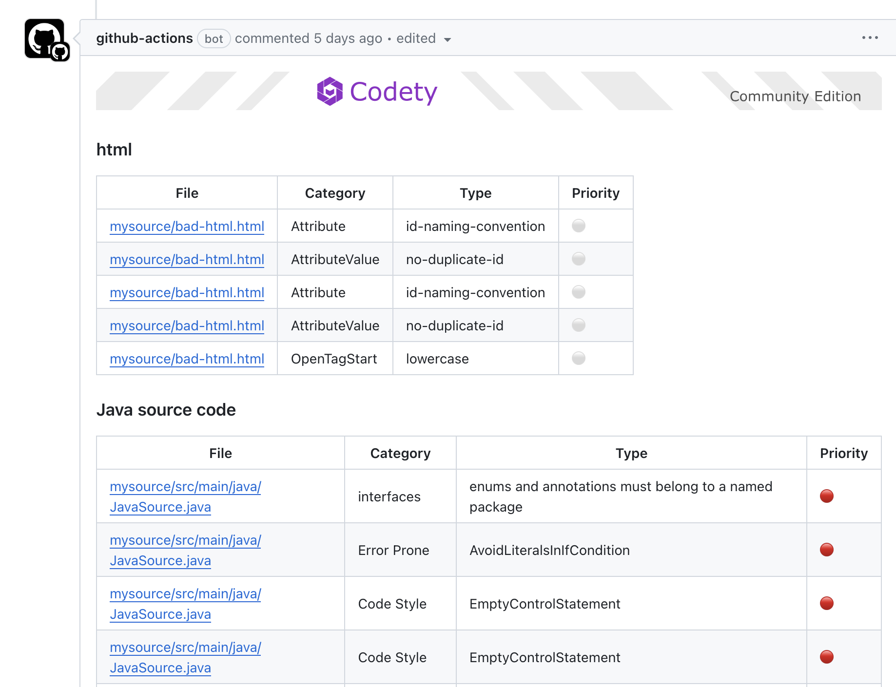

# Codety Quickstart

Let's discover Codety in less than 5 minutes.

### Overview

Based on the above diagram, your CI/CD pipeline will be:
1. Preparing the analysis environment
   * Checking out source code from git server
   * Pulling Codety analyzer image from container registry server
   * Pulling code analysis settings from Codety server (default setting will be applied if you don't set Codety Access Token)
1. Running static code analysis according to the custom ruleset settings
1. Assemble and distribute the result, below is an example:
   

:::tip tips

* The Codety static code analysis will be running inside your CI/CD workflow, and your code will not leave your CI/CD compute environment.
* It is suggested to trigger Codety analysis by pull/merge request events for receiving prompt and relevant code analysis result without letting code quality slip. 

:::

### Start using it
* [Quickstart with GitHub Actions](github-actions)
* [Quickstart with GitLab CI](gitlab-ci)
* [Quickstart with Harness CI](harness-ci)
* [Quickstart with Circle CI](circleci)
* [Quickstart with Bitbucket CI](bitbucket)

### Next step

You can start exploring Codety Cloud-Hosted or Self-Hosted solution for having fine-tuned code analysis settings along with more features.
