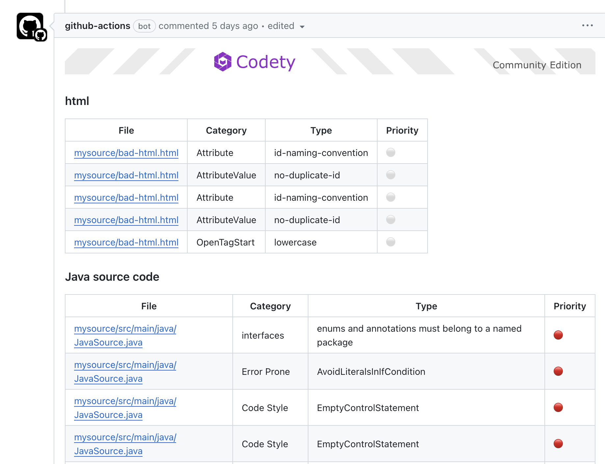

Add GitHub Actions workflow into your git repo, below is an example:
```yaml
# .github/workflows/codety.yaml
name: Codety
on:
  push:
    branches: [ "main" ]
  pull_request:
    branches: [ "**" ]
jobs:
  Codety_Static_Code_Analysis:
    runs-on: ubuntu-latest
    permissions:
      pull-requests: write
      contents: read
    container:
      image: codetyio/codety
    steps:
      - uses: actions/checkout@main
      - run: codety
        env:
          GITHUB_TOKEN: ${{ secrets.GITHUB_TOKEN }}

```
The Codety Analyzer will be triggered when there's a new pull request been created or updated. 

The review comments will be automatically added/updated once the Codety Analyzer job is done:
