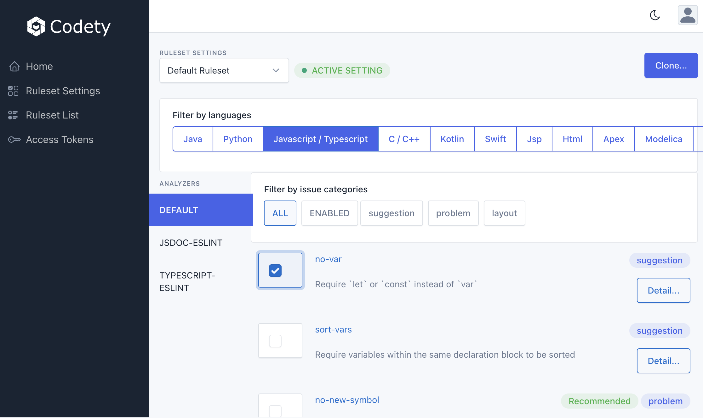

### Version 1.200.10
:tada:  :tada:  :tada: Released the Codety static code analysis solution, support 10+ programming languages(Java, Python, C/C++, Javascript, Typescript, HTML, etc.).

* Added html code analysis support.
* Major UI updates for Codety Console.
* Moved the docker image to https://hub.docker.com/r/codetyio/codety
* Added rule detail for Java.